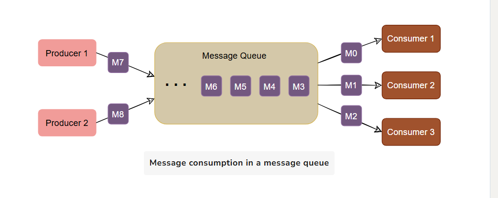

## Messaging Systems

A Messaging system is responsible for transferring data among applications, processes, servers.
There are 2 ways to handle messages->

### Queue model-> 
In queuing model, messages are stored sequentially in a queue. Producers push message to the queue to the rear of the queue
and consumers extract messages from front of the queue.
A particular message can be consumed by maximum of one consumer only. Once a consumer grabs a messages from the queue it is removed from the queue
so that next consumer will get the next message.

### Publisher subscriber messaging systems -> 
In pub sub model, messages are divided into topics. A publisher(producer) sends a message to a topic that gets stored in the messaging system under that topic.
Subscriber(consumers) subscribe to the topic to receive every message published to that topic.
The pub sub model allows multiple consumers to get the same message. If 2 consumers subscribe to the same topic, they will receive all messages published to that topic.
The messaging systems that stores and maintains messages is commonly known as message broker.

#### Apache kafka - 
Apache kafka is a open source publisher subscriber based messaging system. It is a system that takes stream of messages from applications known as producers, stores them 
on a reliable cluster (containing set of brokers) and allows those messages to be received by applications known as consumers.

#### Inbound and Outbound Kafka Topics -

Inbound kafka topics are where producers publish data to be consumed by downstream applications.

Outbound Kafka topics are where consumers subscribe to the topic receive the messages

#### Kafka broker - 
Each server running in the kafka cluster is known as broker. Broker server as connection points for both producers and consumers.

#### Partitions -
Topics are divided into partitions. Partitions start from 0 and continue in increasing numbers.
In Topic a single partition can be created or thousands of partitions be created depending on the scenario.
Thanks to replica in kafka, each partition of the topics is stored in more than one server. One of these server is the leader and other are copies.

#### Event in stream processing -
An event is a record of something that happened that also provides information about what happened.
Example of events are customer orders, payments, trades. In Kafka based architecture, an event record consists of timestamp, key ,value and optional headers.
Typically, events of same type would go to same topics.
Within partition each event is given a unique identifier called as offset. The offset for a given partition will continue to grow as events are added.

